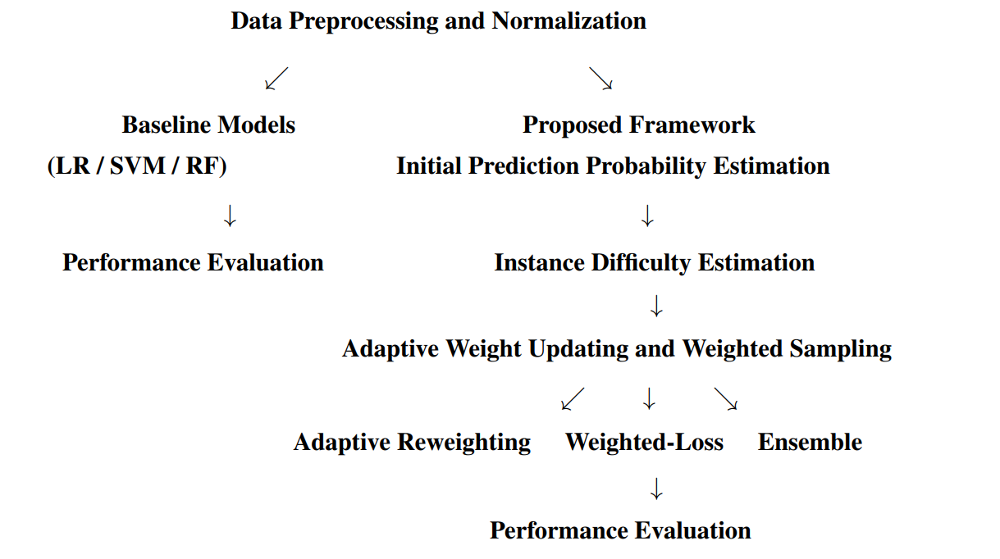
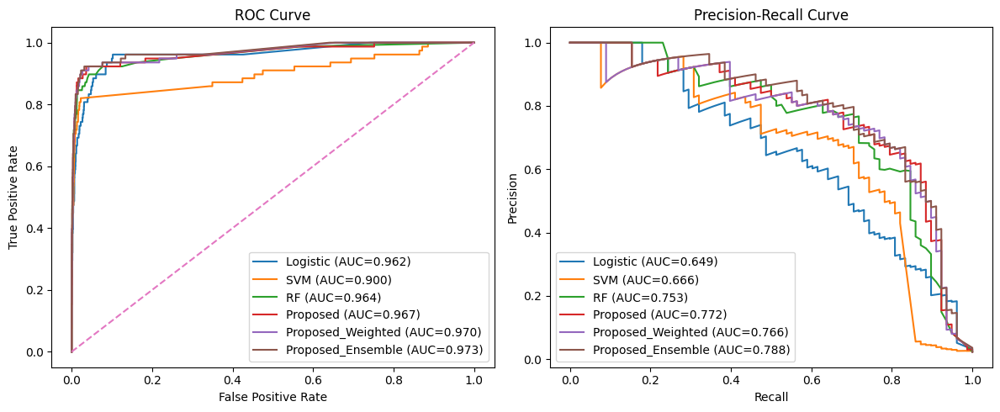
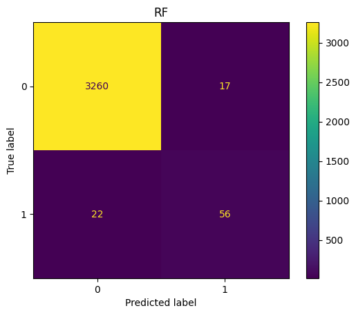
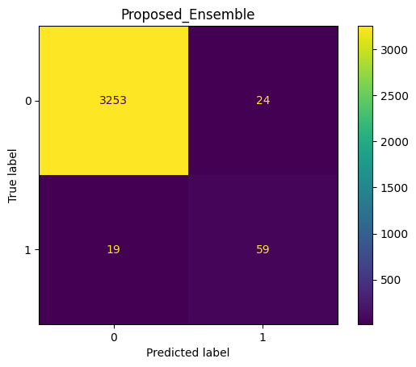
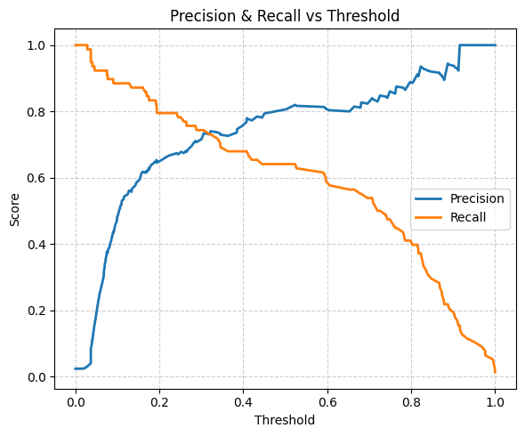

# Adaptive Instance-Level Reweighting for Imbalanced Classification

Implementation and analysis of adaptive instance-level reweighting for imbalanced classification on Credit Card Fraud and Mammography datasets.

---

# Repository Structure

```text
DA5400_Final_Project/
│
├── code_notebooks/                  # Jupyter notebook implementations
│
├── datasets/                        # Local datasets used in experiments
│
├── figures/                         # Experimental result figures and workflow
│
├── presentation/                    # Final presentation slides
│
├── report/                          # Final project report
│
├── README.md                        # Project overview and results
│
├── requirements.txt                 # Python package dependencies
│
└── LICENSE                          # MIT license
```

---

# Problem Motivation

Class imbalance causes machine learning models to become biased toward majority classes, reducing minority-class detection capability.

Applications include:

- Fraud Detection
- Medical Diagnosis
- Anomaly Detection

## Dataset Statistics

| Dataset | Samples | Features | Minority Samples | Imbalance Ratio |
|---|---|---|---|---|
| Credit Card Fraud | 284,807 | 30 | 492 | 577:1 |
| Mammography | 11,183 | 6 | 260 | 42:1 |

---
# Dataset Access (Important Note)

- Credit Card Fraud dataset is automatically downloaded from the TensorFlow/OpenML source inside the notebook.
- Mammography dataset is provided locally for experimentation.

---

# Methodology

The proposed framework dynamically estimates sample difficulty during training and updates sampling probabilities adaptively.

## Adaptive Sampling Probability

$$
w_i = \frac{Difficulty_i}{\sum_j Difficulty_j}
$$

Samples that remain difficult receive higher importance during later training iterations.

---

# Overall Workflow

<p align="center">
  
</p>

Workflow includes:

1. Data preprocessing and normalization  
2. Baseline model training  
3. Instance difficulty estimation  
4. Adaptive weight updating  
5. Weighted sampling  
6. Performance evaluation  

---

# Neural Network Architecture

- FC(128) + ReLU + Dropout
- FC(64) + ReLU + Dropout
- FC(32) + ReLU
- Output Layer (2 neurons)

Framework implemented using:

- PyTorch
- Scikit-learn
- CUDA GPU Acceleration

---

# Experimental Configuration

| Parameter | Value |
|---|---|
| Optimizer | Adam |
| Learning Rate | 0.001 |
| Batch Size | 512 |
| Epochs | 100 |
| Loss Function | Cross-Entropy |
| Device | CUDA GPU |

---

# Experimental Results

# Credit Card Fraud Dataset (577:1)

## Performance Comparison

| Method | F1-score | PR-AUC |
|---|---|---|
| Logistic Regression | 0.7473 | 0.7088 |
| SVM | 0.8240 | 0.8114 |
| Random Forest | 0.8657 | 0.8274 |
| Adaptive Reweighting | 0.8358 | 0.8269 |
| Weighted-Loss Extension | 0.8352 | **0.8612** |
| Ensemble Extension | 0.8240 | 0.8111 |

## ROC and PR Curves

<p align="center">
  
</p>

## Confusion Matrices

<p align="center">
  
</p>

<p align="center">
  
</p>

## Threshold Analysis

<p align="center">
  
</p>

### Key Observations

- Weighted-Loss Extension achieved highest PR-AUC
- Reduced false negatives under extreme imbalance
- Adaptive sampling improved minority-class learning

---

# Mammography Dataset (42:1)

## Performance Comparison

| Method | F1-score | PR-AUC |
|---|---|---|
| Logistic Regression | 0.6211 | 0.6490 |
| SVM | 0.6792 | 0.6660 |
| Random Forest | 0.7417 | 0.7530 |
| Adaptive Reweighting | 0.7308 | 0.7717 |
| Weighted-Loss Extension | 0.7453 | 0.7656 |
| Ensemble Extension | **0.7483** | **0.7884** |

## ROC and PR Curves

<p align="center">
  
</p>

## Confusion Matrices

<p align="center">
  
</p>

<p align="center">
  
</p>

## Threshold Analysis

<p align="center">
  
</p>

### Key Observations

- Ensemble Extension achieved strongest robustness
- Improved PR-AUC and minority detection
- Effective under moderate imbalance

---

# Experimental Observations

| Research Claim | Experimental Observation |
|---|---|
| Adaptive weighting improves minority learning | Improved Recall, F1-score, and PR-AUC |
| Difficult samples require higher importance | Reduced false-negative predictions |
| No oversampling required | Competitive performance achieved |
| Different imbalance levels require different strategies | Weighted-Loss best for severe imbalance, Ensemble best for moderate imbalance |

---

# Key Conclusions

1. Adaptive instance-level weighting effectively improves minority-class detection.

2. Weighted-Loss Extension performs best under extreme imbalance.

3. Ensemble Extension improves robustness for moderate imbalance.

4. Random Forest remains a strong baseline for structured tabular datasets.

---

# Installation

```bash
git clone https://github.com/mm25d950/DA5400_Final_Project.git

cd DA5400_Final_Project

pip install -r requirements.txt
```

---

# Run Notebooks

## Credit Card Fraud Dataset

```bash
jupyter notebook notebooks/final_credit_card_fraud_dataset_code.ipynb
```

## Mammography Dataset

```bash
jupyter notebook notebooks/final_mammography_dataset_code.ipynb
```

---

# Requirements

Main libraries used:

- torch
- scikit-learn
- pandas
- numpy
- matplotlib
- seaborn

---

# Course Information

**Course:** DA5400 — Foundations of Machine Learning

**Institute:** Indian Institute of Technology Madras

**Student:** Ankit Gangwar (MM25D950)

**Instructors:** Prof. Nirav P Bhatt, Dr. P.S Jayadev

---

# Report and Presentation

- Final Report PDF
- Presentation Slides
- Video Presentation

---

# Citation

If you use this repository, please cite the original research paper:

> “A Re-Balancing Strategy for Class-Imbalanced Classification Based on Instance Difficulty”

---

# License

MIT License
